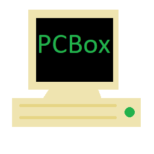
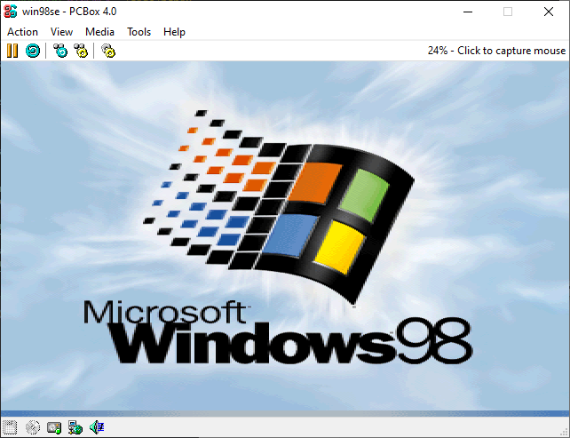
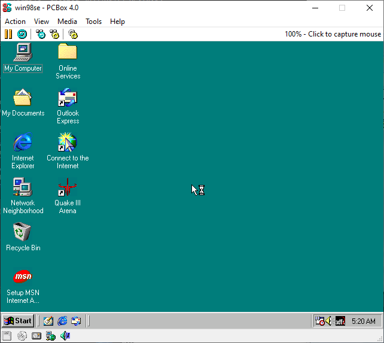

PCBox
=====

PCBox is a PC emulator focused on accuracy and hardware preservation above all else.
PCBox is based on the 86Box emulator.
The PCBox project is lead by [qeeg](https://github.com/qeeg).

Source code repository is at [https://github.com/PCBox/PCBox](https://github.com/PCBox/PCBox)

Read the PCBox documentation at [https://docs.pcbox-emu.xyz/en/latest/](https://docs.pcbox-emu.xyz/en/latest/)

Want to support my work? My Patreon is at [https://www.patreon.com/qeegmfer](https://www.patreon.com/qeegmfer)

The Discord is at [https://discord.gg/mWStgCdXus](https://discord.gg/mWStgCdXus)

The IRC channel is #pcbox on irc.libera.chat

What can I do with PCBox?
=========================
- Learn how computers work at a low level from the source code
- Run certain demos that don't work on much else than real hardware (Like 8088MPH, for instance)
- Run old games or applications, on emulated hardware that they were designed for

Screenshots
===========

Features over 86Box
===================
- Pentium 3 emulation (including SSE)
- More VIA C3 models, including ones that support SSE
- New machines such as the Atari PC 3 and the Atari PC 4
- Experimental support for coreboot BIOSes for a couple of boards (taken from 86box branch feature/mtrr)
- i815 boards (taken from 86box branch feature/ich2)
- Better undefined BCD flag emulation for 8086/8088

Planned improvements for the future
===================================
- Pentium 4 emulation (including SSE2)
- Athlon emulation
- Athlon XP emulation
- More accurate Pentium 3 speeds
- New optional dynamic recompiler that sacrifices timing accuracy for speed
- Rewritten FPU emulation for full 80-bit accuracy using software floating point
- (far future) x86-64 emulation

Minimum System Requirements
===========================
- Intel Core 2 Duo or newer
- Windows 7 or newer, or modern Linux
- 4 GB of RAM

Recommended System Requirements
===============================
- AMD Ryzen 5 7600X, Intel Core i5 13600K, or better
- Windows 11 or newer or modern Linux
- 8 GB of RAM
